# PCB Parameter Description
##PCB Dimension
EasyEDA supports the design of PCBs up to 100cm * 100cm however we suggest our customers try to limit the design to a PCB size of no larger than 45cm * 45cm. We may have to charge more for PCB sizes greater than this because they are harder to fabricate and need a bigger box with more packaging to protect them in shipping.
* If the size is larger than 45cm, you just need to order any pay, we will contact you if you need to charge more via email
* If the size is smaller than 2cm, you need to penalize them to big size, or we can't help you to do the E-test.
 

##PCB Quantity
 EasyEDA uses a group buy model, so the price is very low, but the minimum number of PCBs should be 5 pcs. So for example, if you need 2 pcs, you need to order 5 pcs and similarly, if you need 7 pcs you need to order 10 pcs. 
 
##PCB Thickness
   EasyEDA PCB provides 0.4mm, 0.6mm, 0.8mm, 1.0mm, 1.2mm, 1.6mm, 2.0mm thickness to choose from. If you need a 2.5mm or 3mm thickness board, please ask us for a quote via email.  Please note that not all thicknesses will be available for all numbers of layers; for example no PCB house can fabricate a 32 layer PCB with a 0.4mm thickness!

##PCB Stack up
  ###2 Layer PCB stackup 1Oz
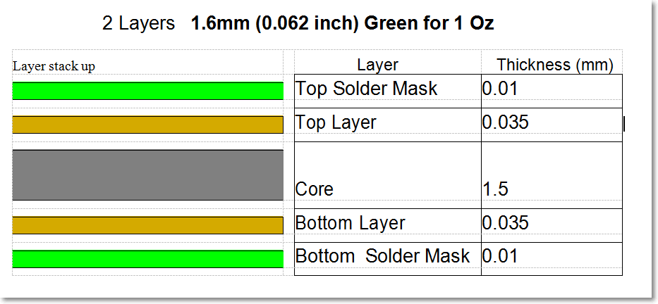  
 

###2 Layer PCB stackup 2Oz
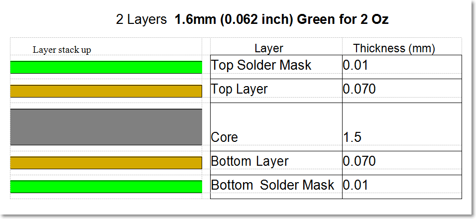  

 ###4 Layer PCB stackup 1Oz
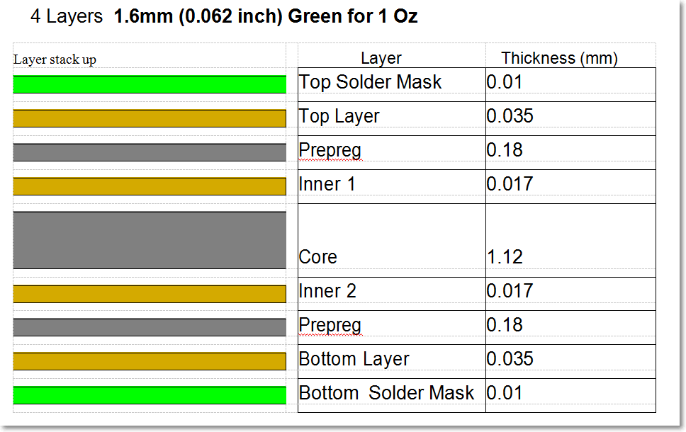 

###4 Layer PCB stackup 2Oz
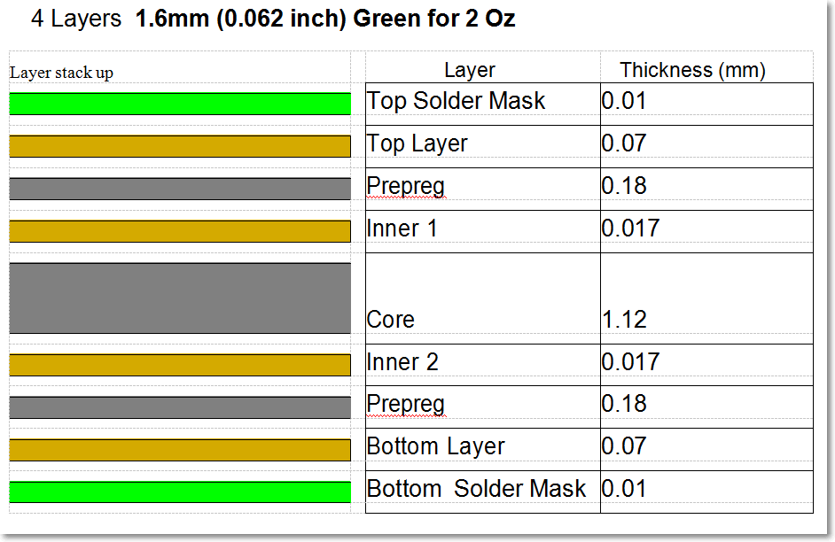 

###6 Layer PCB stackup 1Oz
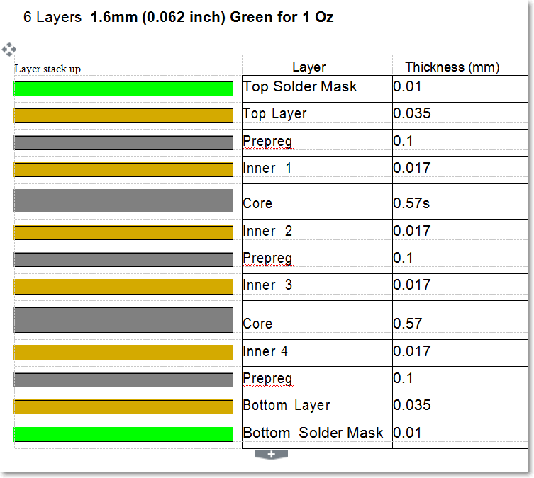 

For other numbers of layers or for a different layer stack up, please email us before placing your order.

##Copper Weight
  You can select 1oz, 2oz, 3oz in our order page. For other copper weights, please ask us for a quote via email: we can help you to fabricate PCBs with copper weights from 0.5oz to 16oz.

##Different Design in Panel 
Some customers would like to merge more than 1 PCB in the same gerber. We know you want to save money but this may make it **hard to cut the board outline** and more importantly this will take a lot more time to pick up and package the PCB. Although by doing this, you just have the one order, this complicates the fabrication of the panel and separation of the individual PCBs, so we will usually charge more for this. Similarly, using holes or slots as breakoff sections between boards are treated the same way as putting more than one design on a panel, each with its' own board outline. 
 
Note: This additional charge only applies if the PCBs on a panel are different. Boards such as in the left hand image below will not incur an additional charge because they are easy to pick up but boards such as in the right hand image would incur an additional charge.
 
   

If you are just in the prototype phase and want to save money, then you can use the following trick. Place your different designs all inside one overall board outline and use lines drawn in the silk layer to mark out the separate the PCBs. Then, when you receive the PCB, carefully cut them apart yourself (we recommend you do this before you assemble the PCBs!). Like the PCB shown below, the yellow lines are drawn in the silk layers showing how you can merge 3 different PCBs in one gerber without incurring any extra costs.

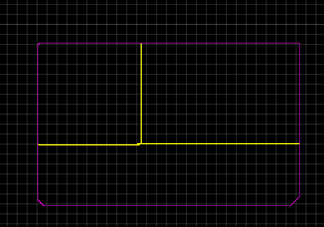  

## V-cut/V-Groove
  
   This will help you to build a PCB Array to save time by making it faster to solder the PCB in SMT. 
   
   

  1.  The V-cut line should be the same as the outline of the Sub-PCB. That is to say, there is zero space between the sub-boards.

  2.  The PCB panel needs to be larger than 8 * 8cm.
  
  3.  The V-cut line must cross the whole panel or else the factory can't add a V-groove on the PCB because the milling cutter may destroy any sub-PCBs on the V-cut line. They also cannot stop part way across the panel. The V-cut lines shown below are not acceptable:
   
 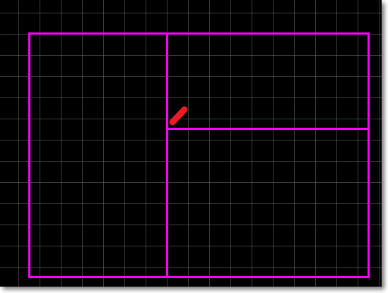  
     

##Material Details
  EasyEDA supports FR4-Standard Tg 140C, FR4-Tg 150C, FR4-High Tg 170C. The FR4 TG's lead time may be more than 6 days. 90% of EasyEDA orders use FR4-Standard. For more information about this, please check the [FR4 Material pdf](images/FR4-material.pdf "FR4 material")

##Smallest Holes Diameter
   0.3mm for mechanical drill, 0.2mm for the laser drill. To save money, please use a minimum drill diameter of 0.3mm.

##Ring
 The width of the ring around vias or pads should be wider than 6mil/0.15mm.
 
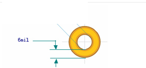  

##Min. Tracing/Spacing
 We support down to 4mil but to save money, please use 6mil. 
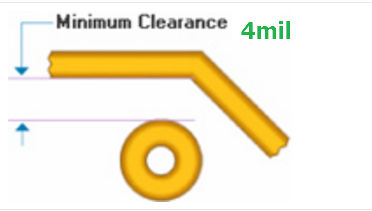  

##Impedance Control
 We support 5% and 10% precision. Please add enough information about your impedance control requirements to help us to fabricate your PCB.

##Gold Fingers
If you wish to built PCBs that plug directly into edge connectors, such as memory cards, please choose **Gold Fingers** as shown in the image below:
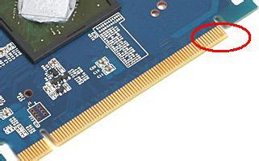  

##Half-cut/Castellated Holes
If you need to build some PCBs as shown in the image below, please choose **Half-cut** holes.

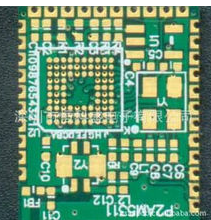

##Panel by EasyEDA
 When your gerber is for just one design and need EasyEDA to help you to duplicate many copies onto one panel, you can use this option.
   You can drag across the rectangles to select then click on the panel to set how many rows and columns as shown in the image below:

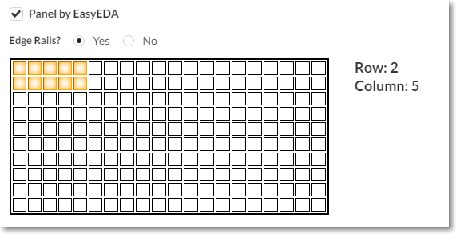

For this image, we will merge 10 small PCBs to 1 big panel. If you order 5 pcs, then we will send 5 big panels to you, each with 10 PCBs on it so you will end up with 50 small PCBs.

If you select the **Edge Rails**, we will add a 5mm board edge as shown in the image below:
This is 2 rows and 5 cols panel PCB.

 

# Stencil Parameter Description
A Stencil can help you to solder the PCB quickly. For efficient and reliable SMT assembly a Stencil is a must.
EasyEDA can provide the option of NON-FRAMEWORK (or frameless) and FRAMEWORK stencils.
The right hand image below shows a frameless stencil. Frameless stencils are cheaper and lower weight(0.2Kg) so they can help to reduce the shipping cost.

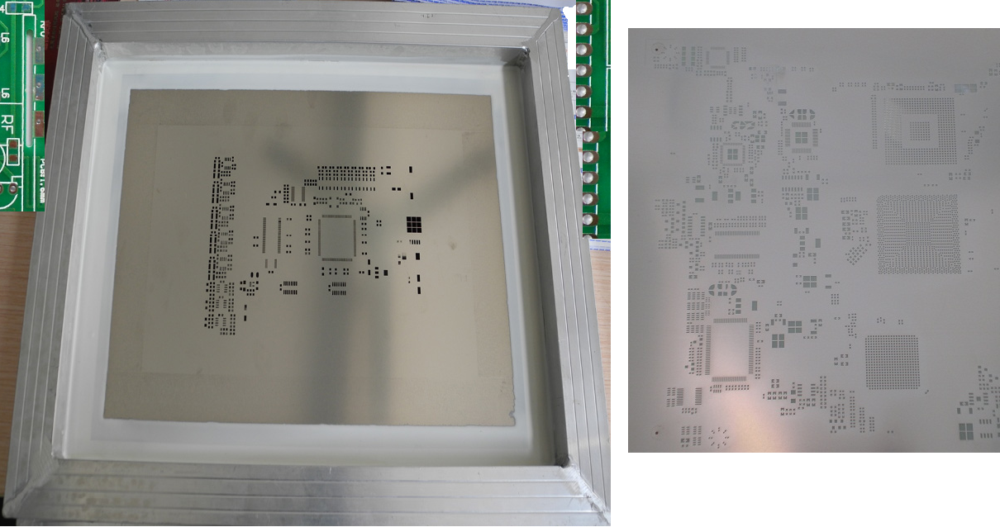  

 

